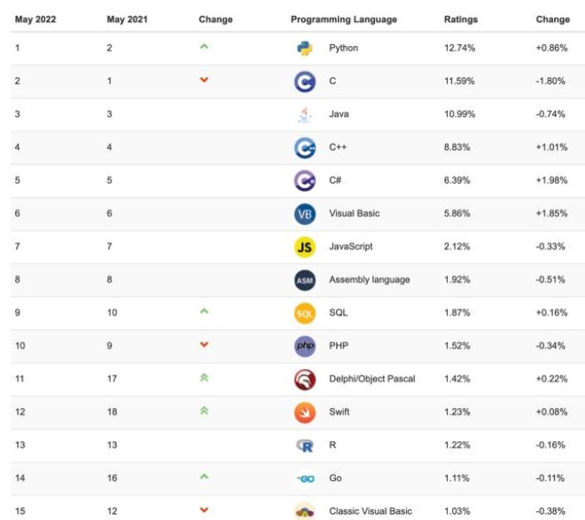

[TOC]

# 前言

## 计算机和网络

### 学习本节内容将可以了解到

1.了解计算机的软硬件基础

2.了解计算机网络

3.了解基本的dos命令


### 一：计算机的软硬件 

**1.进入企业之后的常常工作** 

1）软件的开发汇报工作

​	①使用常用的工具软件

​		收集信息->汇报->讨论->开发->提交

​	②使用常用的办公软件	

​		office软件

2）计算机的日常维护

​	①购置硬软件

​	②修复计算机系统

​	③杀毒


**2.计算机的组成** 

1）硬件

硬件是指完成输入 存储、处理、输出功能的具体设备  

2）软件

软件用来控制硬件正确有效地完成各种功能   QQ   WPS......


Q:  如和购买电脑 看什么配置

主要关注性能和价格-->性价比

构成：

​	主板	显卡	CPU	内存	硬盘	光驱	声卡	音响		......

Q：请问 Intel 和AMD公司的主要产品是什么

​	①中央处理器：计算机运算与控制的核心

​	②CPU得到部件

​		算术逻辑单元（ALU）：负责计算机执行的所有数学和逻辑工作

​		控制单元（CU）：控制计算机的其他部件

​	③CPU的性能指标---主频

​		主频：CPU内核工作的时钟频率，也就是CPU工作频率

​				例如：Intel 酷睿   **i5**    3.2G

​		相关概念：

​			外频：主板上的系统总线的工作频率

​			倍频：CPU外频与主频相差的倍数

​			公式：主频＝外频X倍频

  		如：

​		在生活中会有类似这样的场景，分发物料。有原料分发处，物资分配，生产线和仓库。

​	那么其中物资分配和生产线就相当于CPU,物料的分发就相当于数据。生产线到仓库就是处理的结果。

​	

​	3）硬盘 ：计算机永久性存储介质

​		计算机存储器以位和字节计量

​		 8 bit        —— 1 byte 

​		1024 byte  —— 1 KB 

​		1024 KB    —— 1 MB 

​		1024 MB    —— 1 GB

​		1024 GB    —— 1 TB

​	性能指标：

​		容量：2G→13G → 20G →… → 200G不断攀升

​		转速：硬盘的主轴转速是硬盘内部数据传输率的决定因素之一

​		

4）内存条

​	计算机的存储器

​		主存：RAM、ROM

​		辅存：硬盘、U盘

​	RAM：随机访问存储器

​		内存：计算机的临时存储区

​		特点

​			允许读写数据

​			易失性

​	ROM：只读存储器

​			集成在主路芯片上，存储系统基本数据

​			特点

​				允许访问和读取数据，但不能修改

​				非易失性


5）显卡

​		显卡：

​                   控制电脑的图形输出，负责将CPU送来的的影像数据处理成显示器认识的格式，再送到显示器形成图像

​		显卡决定显示器的刷新频率和分辨率

​		显存容量：显卡上本地显存的容量数

​		大小决定显存临时存储数据的能力，一定程度影响显卡性能

6）主板

​	主板：计算机中各种设备的连接载体

​	主板芯片组决定主板的全部功能

​	主要厂商

​	Intel	华硕	微星	技嘉


### 二：网络

​	1.概述：计算机网络实现数据通信。计算机网络覆盖的地理区域决定了它的类型。

它可分为：局域网，城域网，广域网。

​	1）局域网

​		局限在小的地理区域内或单独的建筑物内

​		范围：几十米～几公里传		

​		特点：输速度快

​		连接设备

​		双绞线，集线器、交换机

​	

​	2）城域网

​		规模局限在一个城市的范围内

​		区域：几公里～几十公里

​		连接设备：光纤，路由器

​		

​	3）广域网

​		网络跨越国界、洲界，甚至全球范围

​		典型代表：Internet

​		连接设备：海底光缆


2.Internet简介

​	Internet ：一个巨大的网络集合

​	Intranet：采用互联网技术的企业内部网

​	Internet提供的服务：远程登录	文件传输   电子邮件    WWW

​			WWW（World Wide Web）: 万维网服务

​			客户端：向另一台计算机请求某种服务的计算机

​			服务器：为其他计算机的请求提供服务的计算机

3.客户端/服务器模型

​	C/S：客户端/服务器

​		客户端向服务器发出请求，服务器处理请求并将响应发送给客户端


​	B/S：浏览器/服务器

​		浏览器将请求发送给Web服务器，Web服务器对请求进行处理，将响应发回浏览器


4.网络通信原理

​	IP地址：唯一标识网络上的每一台计算机	

​	TCP/IP：传输控制/网际协议，Internet的基础 

​	路由交换设备：将数据从一台计算机送到另一台计算机

5.为什么需要域名解析

​	IP地址唯一定位一台主机，需要将www.taobao.com转换成IP地址

​	域名系统（DNS）：将域名映射成IP地址


6.网络的检测和诊断

​	配置了IP地址后，常常出现网络连接不通的故障，怎么检测?

​	使用ipconfig  查看ip地址

​	使用ping检查是否可以ping通地址

​	故障解决：修改ip、检查网线、网卡是否松动、接触不良等。


### 三：dos命令和进制之间的转换

1.dos命令

cd：用于改变当前目录

​	cd ..		返回上一级

​	cd\		返回根目录

​	d:		切换盘符

dir：显示一个目录下的文件和子目录

md：用于新建目录

edit：一个简单的编辑软件，经常用它来编辑一些程序和批处理文件

​	edit a.txt  保存后退出

​	type a.txt    显示文件内容

copy：复制一个或一组文件到指定磁盘或目录中

​	如：copy a.txt d:\myfile

rd：删除空目录【不能删除非空和当前自己目录】

del：删除目录中的一个或一组文件

​	del d:\myfile\*

Move:将文件或目录从一个位置移动到另一个位置

​	move d:\myfile\a.txt  d:\youfile

ren：对目录中的一个文件或一组文件更改名称

​	ren myfile file

fomat：格式化磁盘

​	format d   【轻易不要尝试】


2.进制的转换

1）进制说明

   ①十进制数制系统包括 10 个数字 

​	0、1、2、3、4、5、6、7、8、9

   ②计算机中使用二进制表示数据

​	二进制位：0和1    【101010】

 ③用于缩短二进制的数字长度

​	八进制基数是8，使用的数据 0、1、2、3、4、5、6、7

​	如：123）8

④计算机中以数量表示色彩【RGB】

十六进制数制系统的基数是 16

十进制：		0、1、2、3、4、5、6、7、8、9

十六进制		0、1、2、3、4、5、6、7、8、9 A、B、C、D、E、F

示例：12B、00FFFF

2）进制的转换

为什么需要进行数制转换

人类最容易理解十进制计算机只认二进制

转换举例

（101）10  = 1 * 102  + 0 * 101  + 1 * 100  = 101

（101）2  = 1 * 22 + 0 * 21 + 1 * 20 = 5

（101）8 = 1 * 82 + 0 * 81 + 1 * 80 = 65

（101）16  = 1 * 162  + 0 * 161  + 1 * 160 = 257

**十进制 与八进制的转换** 

~~~java
十进制转换二进制   除以2	取余数
789/2=394 	余1 第10位
394/2=197 	余0 第9位
197/2=98 	余1 第8位
98/2=49 	余0 第7位
49/2=24 	余1 第6位
24/2=12		余0 第5位
12/2=6 		余0 第4位
6/2=3 		余0 第3位
3/2=1 		余1 第2位
1/2=0 		余1 第1位
~~~

~~~java
二进制转十进制
方法一：
小数点前或者整数要从右到左用二进制的每个数去乘以2的相应次方并递增,小数点后则是从左往右乘以二的相应负次方并递减。
1101.01（2）=1*2^0+0*2^1+1*2^2+1*2^3 +0*2^-1+1*2^-2=1+0+4+8+0+0.25=13.25（10）
方法二：
把二进制数首先写成加权系数展开式，然后按十进制加法规则求和。这种做法称为"按权相加"法。
2的0次方是1（任何数的0次方都是1，0的0次方无意义）
二进制数  100011   转成十进制数可以看作这样：
数字中共有三个1 即第六位一个，第二位一个，第一位一个（从右到左），然后对应十进制数即2的0次方+2的1次方+2的5次方， 即
100011=32+0+0+0+2+1=35
~~~


**十进制和八进制的转换** 


~~~java
八->十
描述：八进制就是逢8进1，八进制数采用 0～7这八数来表达一个数。

方法：八进制数从低位到高位（即从右往左）计算，第0位的权值是8的0次方，第1位的权值是8的1次方，第2位的权值是8的2次方，依次递增下去，把最后的结果相加的值就是十进制的值了。

举例：将八进制的(53)O转换为十进制的步骤如下：

第0位 3 x 8^0 = 3；

第1位 5 x 8^1 = 40；

读数，把结果值相加，3+40=43，即(53)O=(43)

~~~

~~~java
十-->八
方法：除8取余法，即每次将整数部分除以8，余数为该位权上的数，而商继续除以8，余数又为上一个位权上的数，这个步骤一直持续下去，直到商为0为止，最后读数时候，从最后一个余数起，一直到最前面的一个余数

举例：将十进制的(796)转换为八进制的步骤如下：

将商796除以8，商99余数为4；

将商99除以8，商12余数为3；

将商12除以8，商1余数为4；

将商1除以8，商0余数为1；

读数，因为最后一位是经过多次除以8才得到的，因此它是最高位，读数字从最后的余数向前读，1434

~~~


~~~java
十六进制转十进制

2AF5换算成10进制:
第0位： 5*16^0=5
第1位： F*16^1=15*16^1=240
第2位： A*16^2=10*16^2=2560
第3位： 2*16^3=8192
直接计算就是：  5*16^0+F*16^1+A*16^2+2*16^3
~~~

~~~JAVA
十进制转十六进制   就是拿一个数除以16
给你一个十进制，比如：120，如何将它转换成十六进制数呢？
10进制数转换成十六进制数，这是一个连续除以16的过程：把要转换的数，除以16，得到商和余数，将商继续除以16，直到商为0。最后将所有余数倒序排列，得到数就是转换结果。

	120  /16 = 7  % 8
     7   /16 = 0  % 7  
  十六进制结果为   78
~~~


## 课程体系介绍 


# 第一部分：java的基础语法


## 第一章 初识 java

### 1.java概述

**1）java是什么** 

   是计算机的一种编程语言,来完成人们下达的指令。类似的还有c、c++、c#  、php、python......

**2）为什么是java** 

   


**3) java的产生**  

Java是Sun Microsystems于1995年推出的高级编程语言；

java之父Jgosling团队在开发”Green”项目时，发现C缺少垃圾回收系统，还有可移植的安全性、分布程序设计、和多线程功能。最后，他们想要一种易于移植到各种设备上的平台。

Java确实是从C语言和C++语言继承了许多成份，甚至可以将Java看成是类C语言发展和衍生的产物。比如Java语言的变量声明，操作符形式，参数传递，流程控制等方面和C语言、C++语言完全相同。但同时，Java是一个纯粹的面向对象的程序设计语言，它继承了 C++语言面向对象技术的核心。Java舍弃了C语言中容易引起错误的指针（以引用取代）、运算符重载（operator overloading）、多重继承（以接口取代）等特性，增加了垃圾回收器功能用于回收不再被引用的对象所占据的内存空间。JDK1.5又引入了泛型编程（Generic Programming）、类型安全的枚举、不定长参数和自动装/拆箱


**4）java的特性** 

​      ①java语言是强壮的

​	丢弃了指针的概念，有了强类型机制，异常处理，垃圾的自动收集等保证了java的强壮性

​     ②安全性

​	java通常被使用在网络环境中，java提供了一个安全机制以防恶意代码的攻击（classLoader）

​     ③高性能

​	相比较那些高性能的脚本语言，java的性能是比较高的。

​    ④解释性

​	可被编译为字节码文件，可以在有java环境的任何平台上运行

   ⑤面向对象性

​	java提供类，继承，接口等语句，为了简单起见，只支持类之间的单继承，接口多继承，类和接口之间实现机制

  ⑥跨平台

​	因为有了JVM，同一个Java 程序在三个【win linux mac】不同的操作系统中都可以执行。这

​	样就实现了Java 程序的跨平台性


**5）java的发展史** 

1991年 Green项目，开发语言最初命名为Oak (橡树) 

1994年，开发组意识到Oak 非常适合于互联网

1996年，发布JDK 1.0，约8.3万个网页应用Java技术来制作

 1997年，发布JDK 1.1，JavaOne会议召开，创当时全球同类会议规模之最

1998年，发布JDK 1.2，同年发布企业平台J2EE

1999年，Java分成J2SE、J2EE和J2ME，JSP/Servlet技术诞生

2004年，发布里程碑式版本：JDK 1.5，为突出此版本的重要性，更名为JDK 5.0

 **2005年，J2SE -> JavaSE，J2EE -> JavaEE，J2ME -> JavaME** 

2009年，Oracle公司收购SUN，交易价格74亿美元

2011年，发布JDK 7.0

2014年，发布JDK 8.0，是继JDK 5.0以来变化最大的版本

 2017年，发布JDK 9.0，最大限度实现模块化

2018年3月，发布JDK 10.0，版本号也称为18.3

2018年9月，发布JDK 11.0，版本号也称为18.9


**6）java的技术体系** 

Java SE(Java Standard Edition)标准版

​	支持面向桌面级应用（如Windows下的应用程序）的Java平台，提供了完整的Java核 

​	心API，此版本以前称为J2SE

Java EE(Java Enterprise Edition)企业版

​	是为开发企业环境下的应用程序提供的一套解决方案。该技术体系中包含的技术如

​	:Servlet 、Jsp等，主要针对于Web应用程序开发。版本以前称为J2EE

Java ME(Java Micro Edition)小型版

​	支持Java程序运行在移动终端（手机、PDA）上的平台，对Java API有所精简，并加

​	入了针对移动终端的支持，此版本以前称为J2ME

Java Card

支持一些Java小程序（Applets）运行在小内存设备（如智能卡）上的平台


### 2.语言环境的搭建 

**1)什么是jdk  什么是jre** 

JDK(Java Development Kit Java开发工具包)

JDK是提供给Java开发人员使用的，其中包含了java的开发工具，也包括了

JRE。所以安装了JDK，就不用在单独安装JRE了。

其中的开发工具：编译工具(javac.exe) 打包工具(jar.exe)等


JRE(Java Runtime Environment Java运行环境) 


包括Java虚拟机(JVM Java Virtual Machine)和Java程序所需的核心类库等，

如果想要运行一个开发好的Java程序，计算机中只需要安装JRE即可


**2)下载jdk**  

www.oracle.com

java.sun.com


**3)安装jdk** 

傻瓜式安装全部点击下一步即可


**4）环境变量的配置**   

计算机---->属性---->高级---->环境变量


变量名：JAVA_HOME
变量值：jdk的安装路径 如：C:\Program Files\Java\jdk1.8.0_77

 


在系统变量中找到 path 点击
变量名：path
变量值：%JAVA_HOME%\bin;   


新建:
变量名：classpath
变量值： .        .当前目录 .class文件所在路径，运行时需要的环境变量

 


检测

都配完以后，检测下成功了就可以开始干活
在开始的位置找到运行点击（或者按win+R）
输入 cmd


分别输入 java -version     和    javac -version  出现自己的jdk版本号以及相关信息即配置成功


 ### 3.HelloWord

计算机认识的二进制文件，但是我们写的识英文。我们编写一个程序需要三个步骤：如下

**1）编写源文件【文件的扩展名打开】**

新建文本文件，将后缀名改为“.java”

~~~java
//public class 是固定的  后面的HelloWorld 是类名，类名需要和文件名一致
public class HelloWorld{
  
  //public static void 和括号里面的参数是固定的，俗称main方法的四要素
  //程序的入口，相当于楼房的大门
  public static void main(String [] args){
     
     //编写的程序代码，每一行语句结束需要以分号结尾
     System.out.println("helloWorld");
  }
}
~~~


**2）编译** 

​	 编译的时候会生产一个以“.class”  结尾的半机器语言

​	编译的命令： javac 类名.java

**3）运行** 

​	运行命令：java 类名

补充：

\n	另起一行 从头开始

\t	一个制表符【空格】


**4)常见错误**

①大括号成对出现

②“String”  中的s 需要大写

③我们编写的代码最后需要  “；”

④每个符号都需要是英文状态下的

⑤打印输出的内容都需要再双引号中

⑥增加代码的可读性

⑦类名一定要和文件名保持一致。


### 4.注释

什么叫注释？

给人看的不是个计算机看的 起到一种解释说明的作用。

**种类** 

单行注释   //

多行注释  /*  */

文档注释  /**    */

在dos中操作命令：

javadoc -d mydoc -autohr -version HelloWord.java


练习：

独立编写HelloJava程序，并配上必要的注释。

2. 将个人的基本信息（姓名、性别、籍贯、住址）打印到控制台上输出。各

   条信息分别占一行。

3. 结合\n(换行)，\t(制表符)，空格等在控制台打印出如下图所示的效果

 


idea  快捷键：

sout:     System.out.println();

psvm:   public static void main(String[] args) {


## 第二章 变量和运算符

### 1.变量

**1）变量的概念** 

定义：内存中一个空间的表示，其值是可以发生变化的


说明：

~~~java

酒店中
房间  	---变量
房间号 	---变量名
房间类型    -- 数据类型
人		  --- 数值

~~~

在内存中 各个变量之间是相互独立的。

类别

在类以内方法以外声明的变量成为全局变量

在方法中声明的变量成为局部变量

成员变量分为：实例变量【不以static修饰】和类变量【以static修饰】

局部变量分为：形参【方法，构造器中声明的变量】，方法局部变量 【方法内】，代码块局部变量【代码块内定义】


**2）变量的使用**

1.声明变量[变量名不能重复]

int  num;

2.给变量赋值

```
num=100;
```


以上1  2 两个步骤可以合并

```
int  age=10;
```

3.使用变量

```
System.out.println(score);
```


```
int score=60;   
表示：在内存中声明一个int类型的空间，给这个空间起一个名字叫score 并且给空间赋值60.
```


**3）案列** 

```
double score=59.5;
char lev='c';
boolean flag=false;  //  true :通过  false :未通过
String  str="明天把你家长叫来";
```

**命名规则**  [但凡是自己起的名字都遵从以下规则]

由数字 字母  下划线 和美元符号组成其中不能以数字开头

不能是关键字

见名知意

驼峰命名规则


包名：多单词组成时所有字母都小写：xxxyyyzzz

类名、接口名：多单词组成时，所有单词的首字母大写：XxxYyyZzz

变量名、方法名：多单词组成时，第一个单词首字母小写，第二个单词开始每个

单词首字母大写：xxxYyyZzz

常量名：所有字母都大写。多单词时每个单词用下划线连接：XXX_YYY_ZZZ


关键字定义：被Java语言赋予了特殊含义，用做专门用途的字符串（单词）

特点：关键字中所有字母都为小写


 


### 2.常量 

概念

定义：内存中一个空间的表示，其值是不可以发生变化的

使用


案列


~~~java
判断是否可以编译通过
1）short s = 5;
s = s-2; //判断：no
2） byte b = 3;
b = b + 4; //判断：no
b = (byte)(b+4); //判断：yes
3）char c = ‘a’;
int i = 5;
float d = .314F;
double result = c+i+d; //判断：yes
4） byte b = 5;
short s = 3;
short t = s + b; //判断：no
~~~


### 3.数据类型

**1基本数据类型**

数值型

​	整数类型

​	byte      1 字节  （-128~127）

​	short     2字节

​	int 	【默认】	4字节

​	long	8字节


​	浮点数【数学中说得带小数点的数】

​	float      4字节

​	double【默认使用】   8字节


布尔类型

​	boolean     当结果只有两种的时候使用

字符型

​	char   表示的识单个字符且需要使用单引号引起了


2.引用数据类型【 可以表示多个字符  且需要使用双引号引起来】

String     接口   数组  枚举


### 4.变量的转换

**1）自动类型转换**


**2）强制类型转换**


### 5.Scanner

import java.util.Scanner   

Scanner scanner =new Scanner(System.in);

scanner.next()

scanner.nextInt();

scanner.nextDouble();


### 6.运算符

**1)赋值运算符** 


**2）算术运算符** 


**3）关系运算符** 


**4）逻辑运算符** 


**5）条件运算符** 


## 第三章 选择结构

### 1.if

**1) 基本if**


**2) 复杂if**


**3) if-else** 


**4) 多重if**


**5) 嵌套if**


### 2.switch

有if为什么还需要有switch? 他们的使用场景是什么


## 第四章 循环结构

​	Q什么是循环？为什么要有循环？生活中的循环有哪些

**定义**：有开始有结束的一直重复的做着的某件事情。

生活中的循环：

吃饭，睡觉  罚抄作业....


### 1.while循环 


语法：

~~~java

while(循环条件){
      循环体
}

~~~


**循环的特点：** 

①循环条件

② 循环体【循环操作】

③//循环变量：能够对循环条件的结果产生影响的量


**while执行的特点**

先判断后执行，有可能是一遍也没循环。


操作：打印50份试卷

​	 打印出100以内的偶数 

​      

~~~java
 /*检查作业  合格的体育课  不合格的上午上机 下午理论*/
        System.out.println("老师我合格了（Y/N）");
        Scanner sc=new Scanner(System.in);
        String answer=sc.next();
        while("N".equals(answer)){
            System.out.println("上午上机下午看书");
            System.out.println("老师我合格了（Y/N）");
            answer=sc.next();
        }
        System.out.println("上体育课...");


~~~

~~~java
      int  i=1;
        while(i<=50){
            System.out.println("打印第"+i+"试卷");
            i++;
        }
~~~


​        

###2.do-while循环

语法：

~~~java
do{
  循环操作
}while(循环条件);


~~~

do-while的循环特点

先执行再判断，至少执行一次。


~~~java
 /*上机做题  合格的上体育课 不合格的继续上机和看书*/
        Scanner sc=new Scanner(System.in);
        String answer="";
        do{
            System.out.println("上机做题");
            System.out.println("老师我合格了（Y/N）");
            answer=sc.next();

        }while("N".equals(answer));
        System.out.println("体育课");
~~~


###3.for循环

适用场景：

for循环更适合用在循环条件确定的情况下。while  和do-while更合适用在循环条件不确定的情况下

语法

~~~java
for(声明变量① ；循环条件② ； 自增变量③){
  	循环操作④
}


~~~


操作：

~~~java
输入一个数完成如下效果：6
  0 + 6 =6
  1 + 5 =6
  2 + 4 =6
  3 + 3 =6
  4 + 2 =6
  5 + 1 =6
  6 + 0 =6


 	    Scanner  sc = new Scanner(System.in);
        System.out.print("请输入一个数：");
        int  num=sc.nextInt();
        for(int i=0,j=num;i<=num;i++,j--){
            System.out.println(i+"+"+j+"="+(i+j));
        }


~~~


###4.break 和continue的运用


作业：

~~~java
1.2012年培养学员25万人，每年增长25%。请问按此增长速度，到哪一年培训学员人数将达到100万人？
    2013年培训学员数量 = 250000 * (1 + 0.25 )
  
   int people =250000;
        int year =0;
        while(people<1000000){
            people= (int) (people*1.25);
            year++;
        }
        System.out.println(year);

2.求1~100之间不能被3整除的数之和

 int sum = 0;
        for(int i=1;i<=100;i++){
            if(i%3!=0){
                sum+=i;
            }
        }
        System.out.println(sum);

~~~


3.完成如下练习

 

 

~~~java
 System.out.println("MyShopping购物系统 >购物结算");
        System.out.println();
        System.out.println("*****************************");
        System.out.println("请选择要购买的商品编号");
        System.out.println("1.T恤      2.网球鞋    3.网球拍");
        System.out.println("*****************************");
        Scanner sc = new Scanner(System.in);
        int num;
        String choice;
        do{
            System.out.print("请选择商品编号:");
            num=sc.nextInt();
            switch (num){
                case 1:
                    System.out.println("T恤          ￥190");break;
                case 2:
                    System.out.println("网球鞋        ￥200");break;
                case 3:
                    System.out.println("网球拍        ￥150");break;
            }
            System.out.println("是否继续?");
            choice=sc.next();
        }while("Y".equals(choice));
        System.out.println("结束");
~~~


4.输入学生的姓名和5门课程的成绩，最后计算5门课程的平均分

  

​		

~~~java
		System.out.print("输入学生的姓名:");
        Scanner sc = new Scanner(System.in);
        String name = sc.next();
        int score;int sum = 0;
        for(int i=1;i<=5;i++){
            System.out.print("请输入5门课中的第"+i+"门课成绩：");
            score = sc.nextInt();
            sum+=score;
        }
        double avg = (double)sum/5;
        System.out.println(name+"的平均分为："+avg);
~~~


5.完成如下练习

 


~~~java
	   Scanner sc = new Scanner(System.in);
        int age;int upSum = 0,downSum = 0;
        for(int i=1;i<=10;i++){
            System.out.print("请输入第"+i+"位顾客的年龄");
            age = sc.nextInt();
            if(age>30){
                upSum++;
            }else{
                downSum++;
            }
        }
        double rateUp = upSum*10;
        double rateDown = downSum*10;
        System.out.println("大于30岁的比例是"+rateUp+"%");
        System.out.println("小于30岁的比例是"+rateDown+"%");
~~~


6.循环录入某学生5门课的成绩并计算平均分。如果某分数录入为负，停止录入并提示录入错误


 


~~~java
  System.out.print("请输入学生姓名:");
        Scanner sc = new Scanner(System.in);
        String name = sc.next();
        int score,sum =0;
        for(int i=1;i<=5;i++){
            System.out.print("请输入第"+i+"门课的成绩:");
            score =sc.nextInt();
            while(score<0||score>100){
                System.out.println("输入有误,请重新输入");
                score = sc.nextInt();
            }
            sum+=score;

        }
        System.out.println("总分是"+sum);
~~~


7.1~10之间的整数相加，得到累加值大于20的当前数

~~~java
 int sum=0;
        for(int i=1;i<=10;i++){
            sum+=i;
            if(sum>20){
                System.out.print(i+" ");
            }
        }
~~~


8.循环录入Java课的学生成绩，统计分数大于等于80分的学生比例

   


~~~java
 Scanner sc = new Scanner(System.in);
        System.out.print("输入总人数:");
        int total = sc.nextInt();
        int score,sum=0;
        for(int i=1;i<=total;i++){
            System.out.print("请输入第"+i+"名同学成绩:");
            score = sc.nextInt();
            if(score>80)
            {
                sum++;
            }
        }
        System.out.println("80分以上的人有:"+sum);
        double rate = (double)sum/total*100;
        System.out.println("80分以上的比例是:"+rate+"%");

~~~


9.输入一个日期，判断是当前年份的第几天

~~~java
 System.out.println("输入年份");
        Scanner sc = new Scanner(System.in);
        int year = sc.nextInt();
        System.out.println("输入月份");
        int month = sc.nextInt();
        System.out.println("输入日期");
        int day =sc.nextInt();
        int sum=0;
        switch (month-1){
            case 11:day += 30;
            case 10:day += 31;
            case 9:day += 30;
            case 8:day += 31;
            case 7:day += 31;
            case 6:day += 30;
            case 5:day += 31;
            case 4:day += 30;
            case 3:day += 31;
            case 2:day += 28;
            case 1:day += 31;
        }
        if ((month !=1 && month!=2) && (year%4==0&&year%100!=0)||(year%400==0)){
            day+=1;
        }
        System.out.println(day);
~~~


## 第五章 数组

###1.数组的概念和语法

变量是在内存中声明的一个空间，如果数值较多的话，声明也是可以的但是比较麻烦，

**作用**：在内存中声明一连串的空间，可以节省声明的变量。

**特点**：①声明的空间一旦确定了就不能更改了。

​	   ②在一个连续的空间中只能存一种数据类型的数据【就是声明的那种类型】

​	  ③数组下标从0开始


**易错点**：

​	数组下标越界：存的值的个数超过了声明数组的长度【编译没问题运行出现    	ArrayIndexOutOfBoundsException】


  变量有哪些东西： 数据类型 	变量名 	数值

数组有哪些东西	  数组类型	数组名	数值


使用：

语法：

~~~java
数组的声明
int  [] num;
int  num [];


赋值：
 int num[]=new int[3];
		 num[0]=12;
        num[1]=22;
        num[2]=32;


	 //数组的声明  方式二
        int score[]=new int[]{22,33,44,55};


	 //数组的声明  方式三
        String names[]={"aa","bb","cc"};


 	 //遍历数组
        for(int i=0;i<names.length;i++){
            System.out.print(names[i]+" ");
        }

~~~

### 2.数组的常规应用


案列：计算5名学生的平均分

~~~java
	  //声明一个5个长度的数组  来存5个学生的成绩
        int [] scores=new int[5];
        Scanner sc =new Scanner(System.in);
         //声明变量  求和
        int  sum=0;
        for(int i=0;i<scores.length;i++){
            System.out.println("请输入第"+(i+1)+"学生的成绩;");
            scores[i]=sc.nextInt();
            sum+=scores[i];
        }
        int avg=  sum/scores.length;
        System.out.println("平均分是："+avg);
~~~


~~~java
有一个数列：8，4，2，1，23，344，12
循环输出数列的值
求数列中所有数值的和
猜数游戏：从键盘中任意输入一个数据，判断数列中是否包含此数 


int  arr[] ={8,4,2,1,23,344,12};
//第一问
       /* for(int i=0;i<arr.length;i++){
            System.out.print(arr[i]+" ");
        }*/

//第二问
       /* int sum=0;
        for(int i=0;i<arr.length;i++){
          sum+= arr[i];
        }
        System.out.println(sum);*/

//第三问
        Scanner sc=new Scanner(System.in);
        System.out.println("请输入一个整数：");
        int n =sc.nextInt();

        boolean flag=false;    //  false  不包含  true  包含

        for(int i=0;i<arr.length;i++) {

                    if(arr[i]==n){
                        flag=true;
                        break;
                    }
        }
        if(flag){
            System.out.println("包含");
        }else{
            System.out.println("不包含");
        }

~~~


案列

~~~java
 Scanner input = new Scanner(System.in);
        double arr[] = new double[5];
        double sum = 0 ;
        for (int i=0;i<arr.length;i++){
            System.out.println("请输入金额：");
            arr[i] = input.nextDouble();
            sum += arr[i];
        }

        System.out.println("序号\t金额（元）");
        for (int i=0;i<arr.length;i++){
            System.out.println((i+1)+ "\t"+arr[i]);
        }
        System.out.println("总金额为"+sum);
~~~

案列：

计算数组中最大值 最小值

~~~java
     int arr[]={12,2,1,78,55};
        //假设最大值是第一个数
        int max= arr[0];

        for(int i=0;i<arr.length;i++){
           //如果最大值比其中某个值还小 则将大的值赋值给max
            if(max<arr[i]){
                max=arr[i];
            }
        }

        System.out.println("最大值是："+max);
~~~


**Arrays类的常见方法** 

| 方法名称                          | 说明                                      |
| ----------------------------- | --------------------------------------- |
| boolean equals(array1,array2) | 比较array1和array2两个数组是否相等                 |
| sort(array)                   | 对数组array的元素进行升序排列                       |
| String toString(array)        | 将一个数组array转换成一个字符串                      |
| void fill(array,val)          | 把数组array所有元素都赋值为val                     |
| copyOf(array,length)          | 把数组array复制成一个长度为length的新数组，返回类型与复制的数组一致 |
| int binarySearch(array, val)  | 查询元素值val在数组array中的下标（要求数组中元素已经按升序排列）    |


​         操作演示：	

~~~java

        int arr1[]={1,3,5,7,9};
        int arr2[]={1,3,5,7,9};
        int arr3[]={1,77,3,5,7};

        //equals(a1,a2)   比较两个数组 a1 a2 是否相等
        boolean result=Arrays.equals(arr1,arr2);
        boolean result1=Arrays.equals(arr1,arr3);
      //  System.out.println(result+" "+result1);

        //sort(arr)  //对arr排序
        //toString()将一个数组转换为一个字符串

       /* Arrays.sort(arr3);  //对数组进行排序
        System.out.println(Arrays.toString(arr3));*/


        //fill(arr,val)  将数组arr中的值替换为val

       /* Arrays.fill(arr3,11);
        System.out.println(Arrays.toString(arr3));*/

       //copyOf(array,length)  将数组array  扩容成一个长度为leanth的新数组
      /*int arr[] =  Arrays.copyOf(arr3,7);
        //System.out.println(arr.length);
        for(int i=0;i<arr.length;i++){
            System.out.print(arr[i]+" ");
        }*/

        Arrays.sort(arr3);
         int index=  Arrays.binarySearch(arr3,1);
        System.out.println(index);
~~~


操作：

在一个数组中 插入一个数，插在第一个比它小的数的前面。

~~~java
	 //声明一个长度为6的数组
        int list[] =new int[6];
        list[0]=12;
        list[1]=7;
        list[2]=9;
        list[3]=102;
        list[4]=22;
        //留一个空位置给新插入的值
        //新插入得值假设下标为  最后一个空位置
        int index=list.length-1;

        /**
         * 2.提示用户输入值
         */
        Scanner sc=new Scanner(System.in);
        System.out.print("请输入一个整数：");
        int n=sc.nextInt();

        /*
        * 3.遍历原有数组所有值，然后判断 新值有没有大于原值
        * 如果有  将原来的值得下标赋值给  index     然后break;  后面
        * 的内容不用再看
        * */
        for(int i=0;i<list.length;i++){
            //判断输入的值   n  是否有大于list[i]
            if(n>list[i]){
                index=i;
                break;
            }
        }


        /*
        *
        * 4.移动数据的位置  从最后一个数据开始逐步向后移动一个
        * 直到移动到index  为止
        * */

        for(int i=list.length-1;i>index;i--){
            list[i]=list[i-1];
        }


        /*
        *
        * 5.将输入的值给index  最后遍历数组
        * */
        list[index]=n;
        System.out.println("下标是："+index);
        System.out.println("值是："+n);
        System.out.println("插入后的值是：");
        for(int i=0;i<list.length;i++){
            System.out.print(list[i]+" ");
        }

~~~


### 3.二维数组

概念：数组的数组

语法：

~~~java

int [] [] arr=new  int[3][4]
arr[0][0]=12;
arr[1][3]=22;


int [][]list={{1,2,3},{2,3,4},{3,4,5}}


遍历：
 int [][]list={{1,2,3,4},{2,3,4},{3,4,5}};
        
        for(int i=0;i<list.length;i++){
            for(int j=0;j<list[i].length;j++){
                System.out.print(list[i][j]+" ");
            }
        }

~~~


**操作：** 

1.三个班五名学生的平均分

~~~java
     Scanner sc=new Scanner(System.in);
        /*计算三个班级每个班级4名学生的成绩平均分*/

        /*1.先思考如何计算一个班级的学生平均分*/
        int score=0;
        int sum=0;
        for(int j=1;j<=3;j++){
            System.out.println("请输入第"+j+"个班级的成绩");
             sum=0;

            for(int i=1;i<=4;i++){
                System.out.print("请输入第"+i+"个学生的成绩");
                score=sc.nextInt();
                sum+=score;
            }
            System.out.println("第"+j+"个班级的平均分是："+sum/4);
        }
~~~


2.打印四边形的 *【五行五列】

~~~java
//要求：打印五行五列的*
        //思路：先打印一行的 然后将一行执行多次


        for(int j=1;j<=5;j++){   //外层循环执行一次，内层循环执行一遍
            for(int i=1;i<=5;i++){
                System.out.print("*");
            }
            System.out.println();
        }
~~~


3.打印直角三角形 输入一个值来制定行数，当前行都是比下一行少2个*   【2* i-1】

~~~java
行i		星星j
1		   1	
2		   3	
3		   5	
4		   7	
5		   9	
j=2*i-1

~~~


~~~java
	   Scanner sc = new Scanner(System.in);
        System.out.print("输入星星的行数：");
        int n=sc.nextInt();
        for(int i=1;i<=n;i++){
           for(int j=1;j<=(2*i-1);j++){
               System.out.print("*");
           }
            System.out.println();
        }
~~~


4.打印倒直角三角形【num+1-i】

~~~java

行i 	    星星j
1		5
2		4
3		3
4		2
5		1
  
j=num+1-i     num是输入的行数
~~~


~~~java
 Scanner sc = new Scanner(System.in);
        System.out.print("输入星星的行数：");
        int n=sc.nextInt();
        for(int i=n;i>=1;i--){
            for(int j=1; j<=(2*i-1);j++){
                System.out.print("*");
            }
            System.out.println();
        }
~~~


5.打印等腰三角形【】

~~~java
行i		星星j		空格k	
1		   1		4
2		   3 		3
3		   5		2
4		   7		1
5		   9		0
 星星和行的关系： j=2*i-1
 空格和行的关系： k=5-i 

~~~

~~~java
	   Scanner sc = new Scanner(System.in);
        System.out.print("输入星星的行数：");
        int n=sc.nextInt();
        /*打印行*/
        for(int i=1;i<=n;i++){
            /*打印空格*/
            for(int k=1;k<=(n-i);k++){
                System.out.print(" ");
            }
            /*打印星星*/
            for(int j=1;j<=(2*i-1);j++){
                System.out.print("*");
            }
            System.out.println();

        }
~~~


九九乘法表

~~~java
	for (int i = 1; i <=9 ; i++) {
            for (int j = 1; j <=i ; j++) {
                System.out.print(j+"*"+i+"="+(j*i)+"\t");
            }
            System.out.println();
        }
~~~


5.冒泡排序

~~~java
 int arr[]={77,66,9,100,1};
        System.out.println("冒泡排序之前的样子：");
        for(int i=0;i<arr.length;i++){
            System.out.print(arr[i]+" ");
        }


        //外层循环 控制的识 轮数
        for(int i=0;i<arr.length-1;i++){
            //内层循环控制的是每轮的次数
            System.out.println(i);
            for(int j=0;j<arr.length-i-1;j++){
                if(arr[j]>arr[j+1]){
                    int t=arr[j];
                    arr[j]=arr[j+1];
                    arr[j+1]=t;
                }
            }

        }
        System.out.println("冒泡排序之后的样子*******：");
        for(int i=0;i<arr.length;i++){
            System.out.print(arr[i]+" ");
        }


~~~

## 项目 吃货联盟

